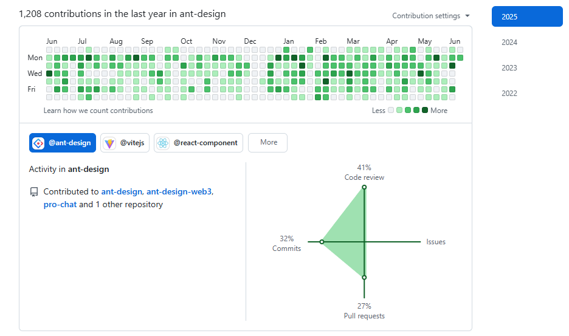

|  |  |
| ----------------------------------------------------------------------------------------------------------------------------------------------- | --------------------------------------------------------------------------------------------------------------------------------------------------------- |

Hi, I'm thinkasany.

The Member of [ant-design](https://github.com/ant-design/ant-design)、[ant-design-web3](https://github.com/ant-design/ant-design-web3)、[doocs](https://github.com/doocs)、[hellof2e](https://github.com/hellof2e).

I'm also maintaining [vitest-dev/docs-cn](https://github.com/vitest-dev/docs-cn)、[vitejs/docs-cn](https://github.com/vitejs/docs-cn).

I have written a full-stack practical project: [miniprogram-taro-react](https://github.com/thinkasany/shop-miniprogram-taro)、 [admin-vue](https://github.com/thinkasany/shop-admin-vue)、[server-nest](https://github.com/thinkasany/shop-server-nest).

I’m currently active on the following repo/commit, you can click on the badge to view my commit history.

<!-- 

 -->

 
 

You can also learn about me through [atomgit open source data analysis](https://ossinsight.atomgit.com/analyze/thinkasany) and [opensource code power list](https://opensource.win/thinkasany/).

 

<!--  -->

